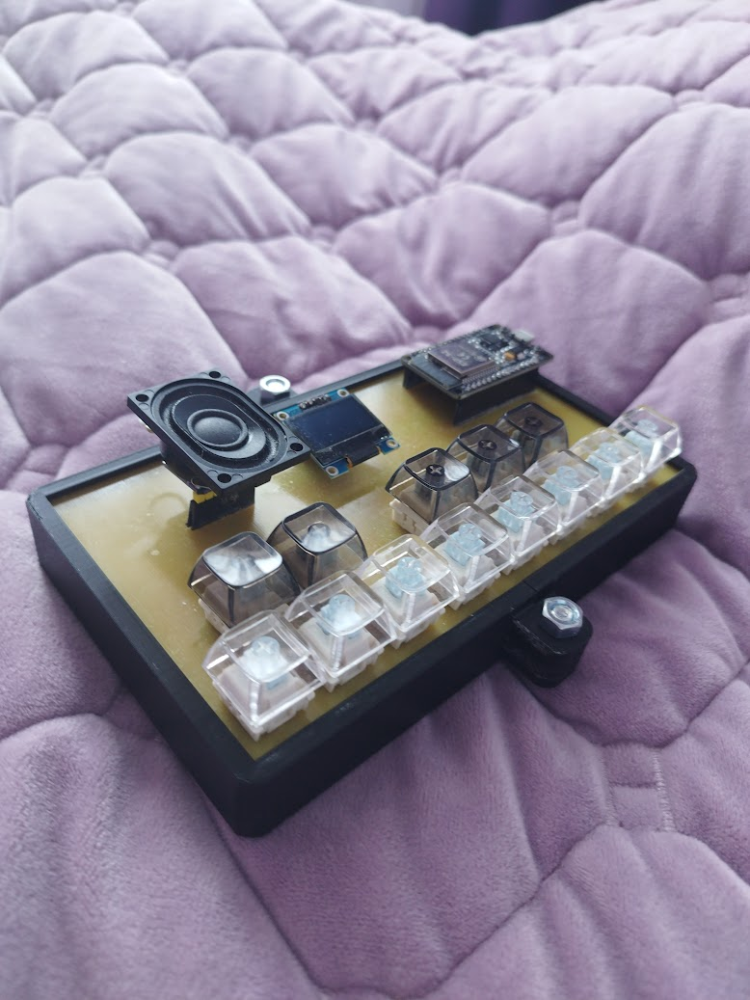
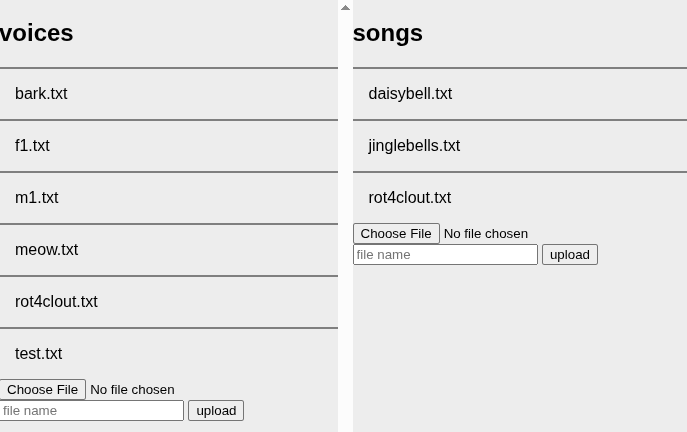

# OpenVocakey
An open-source ESP32-based vocal synthesis keyboard



## What is this?
This is exactly what it sounds like -- a DIY open-source keyboard capable of producing human-like speech in the form of singing. Yes, just like VOCALOID -- except it is live, so it would be closer to [Pocket Miku](https://youtu.be/Uk6hSK1DDR4) or the [VOCALOID Keytar](https://en.wikipedia.org/wiki/Vocaloid_Keyboard).

### What is this based on?
It uses [espeak-ng](https://github.com/espeak-ng/espeak-ng) at its core, with the wrapper being [BackgroundAudio](https://github.com/earlephilhower/BackgroundAudio) and the wrapper wrapper being `tts.cpp`. This means that the voices are actually very customizable! You can use formant settings to adjust the voice to your liking and then upload it to the device.

## How do I use it?
You can buy a [Cardputer](https://shop.m5stack.com/products/m5stack-cardputer-adv-version-esp32-s3) if you wanna check the project out, or make a keyboard of your own with the provided gerber and KiCad files. Then, you can upload songs and files using the [online tool](https://milk-cool.github.io/OpenVocakey/) (works best with Chromium-based browsers).

### Song format
A song is just a text file containing Japanese characters (hiragana or katakana but NOT kanji), with each syllable on its own line, for example:
```
き
ら
き
ら
ひ
か
る
```

> Note: you can input more than one syllable on one line, but then the vowel stretch won't work properly.

### Voice format
This is just an espeak-ng voice, but without the `pitch` and `language` fields (those are added automatically). See [the documentation for espeak-ng](https://github.com/espeak-ng/espeak-ng/blob/master/docs/voices.md) for specific instructions on how to create a voice.

### Assembling the board
If you decidedto make your own keyboard, first of all, you'd have to order a two-layer PCB. This is because one of the traces (yes, just one!) is on the other side of the PCB. Then, once it arrives, you have to solder MX-Cherry style keyboard switches into the holes on the bottom of the board (and add keycaps to your liking) and solder on female 2.54mm headers everywhere else. Then, you can insert a 30-pin ESP32 board into the double headers (with the USB port facing outwards), an i2c SSD1306 display into the middle headers (facing inwards) and a MAX98357a i2s audio amplifier into the remaining headers (facing outwards; don't forget to connect a speaker!!). Also don't forget to solder on the 10K resistors for pull-up below the ESP32. Then you'd have to upload the firmware to the ESP32 and you're done!!

> Note: see `bom.csv` for the Bill of Materials.

### Navigating the menus
You can press BOOT/G0 on your board to enter the menu. From there, you can press the two leftmost white buttons to move left or right, and the rightmost two white buttons for cancelling and confirming your actions (e. g. entering a submenu and then confirming the volume change using the rightmost button). You can also press G0 again to leave the menu.

Go on, play around with the menus and see what you can customize!!

> Note: most settings are discarded upon reboot.

### Using the website


You can use the [online tool](https://milk-cool.github.io/OpenVocakey/) to manage the files on your OpenVocakey. First, click "Connect" in the corner and select your board. Then, you can download the already existing files by clicking on them, or upload new files by first selecting the file, then giving it a name and then clicking "upload".

> Note: that **WILL** overwrite the file! Be careful.

## Why does this exist?
I was always fascinated by vocaloids and the two aforementioned products in paticular, hence I decided to make this. Those can be hard to get and rather unaffordable, especially in non-first-world countries, therefore I think people might find this useful.